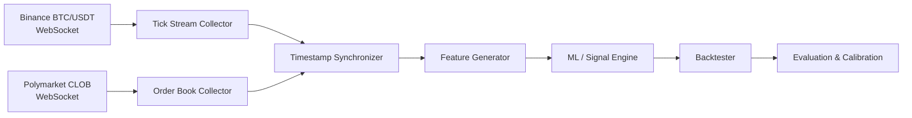
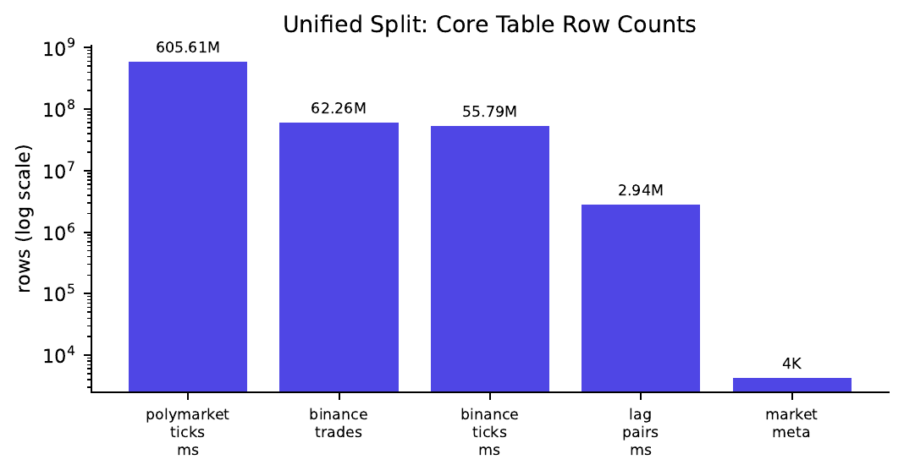
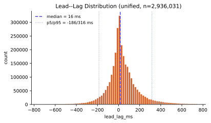
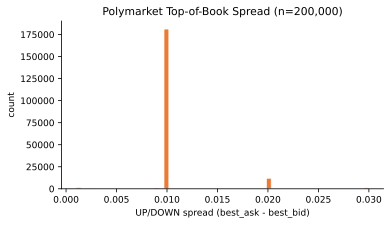
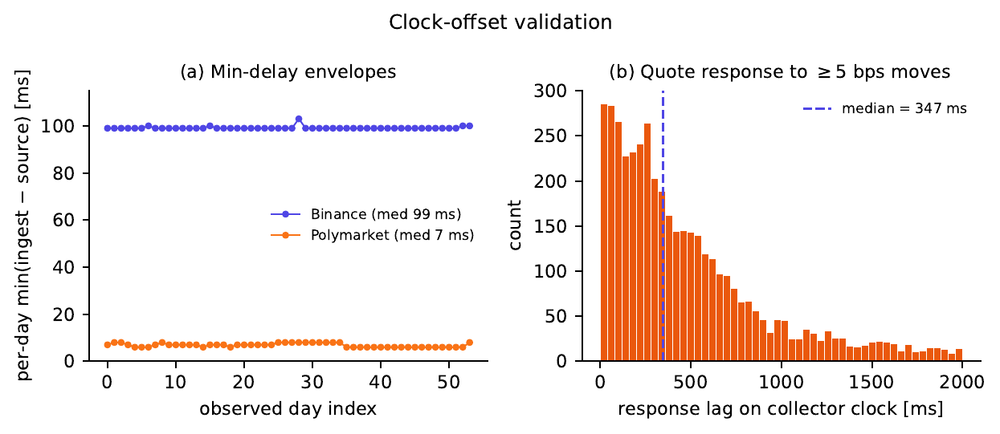
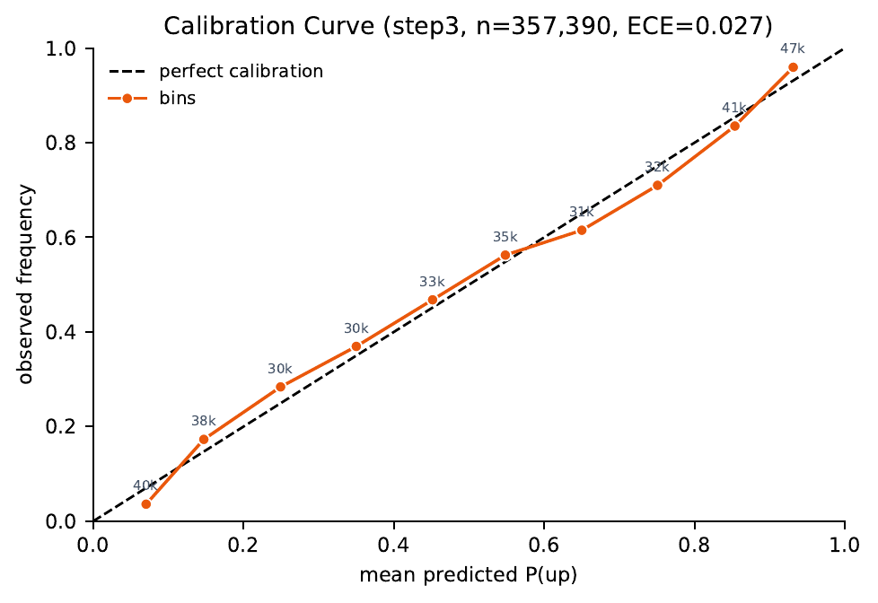
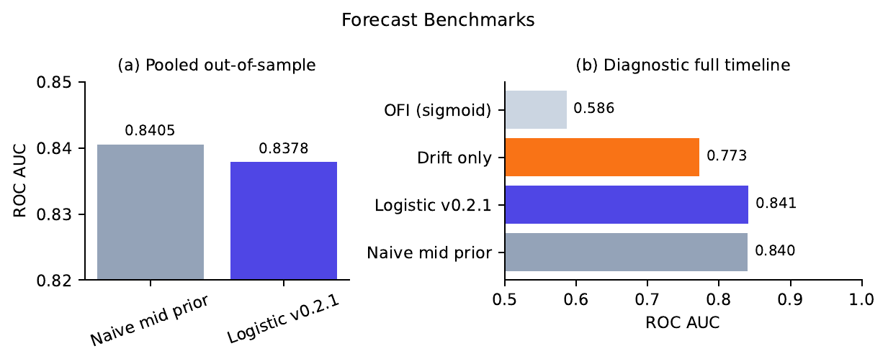
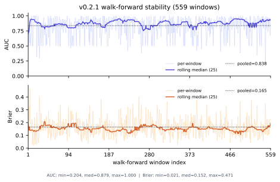

<div align="center">

# OpenMarket

**A public, millisecond-level Polymarket BTC / Binance BTC-USDT paired corpus and Rust research platform.**

[](https://github.com/gregyoung14/openmarket/actions/workflows/ci.yml)
[](https://github.com/gregyoung14/openmarket/releases)
[](LICENSE)
[](https://www.rust-lang.org/)
[](https://huggingface.co/datasets/gregyoung14/openmarket-btc-polymarket)
[](https://huggingface.co/gregyoung14/openmarket-models)

[](https://huggingface.co/datasets/gregyoung14/openmarket-btc-polymarket)
[](https://huggingface.co/datasets/gregyoung14/openmarket-btc-polymarket)
[](https://huggingface.co/datasets/gregyoung14/openmarket-btc-polymarket)
[](https://huggingface.co/gregyoung14/openmarket-models)

</div>

---

OpenMarket is an open-source Rust research platform and frozen dataset release for collecting, pairing, and backtesting high-frequency Polymarket prediction-market data against Binance BTC/USDT.

The goal is **reproducible prediction-market research**, not a black-box trading bot. The repository contains collectors, a recorder, exporters, trainers, backtesters, schemas, documentation, and release scripts. Large datasets and pretrained models are released separately through Hugging Face.

> **Archive status:** OpenMarket is in archival shutdown. The complete 202-snapshot CDN archive is published on Hugging Face and the project is frozen as a public research record at source tag `v0.5.2`.

## At a glance

| | |
|---|---:|
| **Snapshot publication window** | 109 days (2026-03-14 → 2026-07-01) |
| **Observed event span** | 93 calendar days (2026-02-12 → 2026-05-15) |
| **Observed event days** | 54 Polymarket / 57 Binance |
| **Operator snapshots** | 202 SQLite snapshots (46 GB compressed) |
| **Unified corpus** | 727,098,247 rows / 8.7 GiB Parquet |
| **Cross-venue pairs** | 2,936,031 explicit `lag_pairs_ms` |
| **Apparent source-clock lead–lag** | 16 ms median (5th/95th: −186 / +316 ms) |
| **Collector-clock quote response** | 347 ms median after large Binance moves |
| **Polymarket ticks** | 605,608,370 |
| **Binance trades** | 62,258,815 |
| **Markets tracked** | 4,450 (2,251 with sufficient data for modeling) |
| **Rust workspace** | 17,824 LOC |

## Why this matters

Polymarket's short-horizon BTC binary markets combine prediction-market forecasting with crypto-native CLOB microstructure. Empirical work documents tick-level Polymarket dynamics and combinatorial arbitrage, but a **public, cross-venue, millisecond-resolution corpus paired with Binance BTC/USDT** has been missing.

OpenMarket closes that gap by publishing:

1. **Corpus** — a frozen Hugging Face archive with raw per-snapshot exports and a deduped unified timeline.
2. **Methods** — documented source-vs.-ingest pairing, clock-offset validation, Parquet-native export, walk-forward calibration, and validation harnesses.
3. **Baselines** — stylized facts, forecast benchmarks, and a clearly reported null trading result on the released corpus.

> **Transparency:** the published `v0.2.1` model shows calibration and ranking skill, but it matches rather than beats the naive Polymarket mid-price prior out of sample, and simulated economics under stated fees and slippage are negative. This is a data-and-methods release, not a claim of deployable trading alpha.

## Architecture



The codebase is a Rust workspace spanning exchange collectors, a multi-market recorder with lag-pairing export, signal and execution engines, backtesting, and Parquet-native ML crates.

## Dataset

Live on Hugging Face: [`gregyoung14/openmarket-btc-polymarket`](https://huggingface.co/datasets/gregyoung14/openmarket-btc-polymarket)

| Split | Version | Purpose |
|---|---|---|
| `unified/` | `v0.4.3-unified` | **Recommended** — deduped research timeline (727M rows, 504 parquet files) |
| `full/` | `v0.2-full` | Complete 202-snapshot per-export archive (3,312 parquet files) |
| `features/` | `v0.4-features` | Optional one-snapshot demo; full step2/step3 reproducible from `unified/` |
| (repo root) | `v0.1-sample` | CI and quickstarts — 12 flat parquet files, 9,352 rows |

```text
*.parquet                    # v0.1-sample (flat at repo root)
unified/                     # deduped research timeline (v0.4.3-unified)
full/                        # per-snapshot exports, 202 snapshots (v0.2-full)
features/                    # optional ML feature exports (v0.4-features)
metadata/
  snapshot_manifest.json     # full archive inventory (CDN URLs redacted)
unified/metadata/
  merge_quality_report.json  # unified dedupe stats
full/metadata/
  per-snapshot export reports
README.md
```

**Dedupe:** 916M input rows across overlapping `full/` exports → 727M output rows (~21% duplicates removed). Each `full/` snapshot is a point-in-time recorder checkpoint published for reproducibility and recovery, not an append-only delta.

See [`datasets/README.md`](datasets/README.md) and [`docs/data/dataset-release.md`](docs/data/dataset-release.md) for schema and download details.

## Microstructure findings

Key stylized facts and validation results from the released corpus:

- **Compact apparent source-clock lag.** Paired Polymarket order-book events trail Binance by a median of **16 ms**, with heavy tails (5th/95th: −186 / +316 ms). Per-day transport-delay envelopes bound relative clock drift to **≤6 ms**, but a single collector cannot identify a constant venue-clock offset; read the 16 ms as an apparent source-clock median.
- **Collector-clock response.** A synchronization-free event study finds Polymarket quote changes after large Binance moves with a median **347 ms** response lag, measured entirely on the collector's ingest clock.
- **Lag is disagreement-invariant.** Median lead–lag is stable (16–19 ms) across `|price_delta_bps|` quintiles; magnitude does not predict contemporaneous price disagreement.
- **Tight spreads.** Top-of-book spreads concentrate at one tick wide (median `0.01`; 95th `0.02`; 91.9% one-tick), so mid-price backtests can overstate executable edge.

<div align="center">
  <table>
    <tr>
      <td align="center"><br/><sub>Core table row counts in the unified split</sub></td>
      <td align="center"><br/><sub>Distribution of lead–lag across all pairs</sub></td>
    </tr>
    <tr>
      <td align="center"><br/><sub>Top-of-book spread stylized facts</sub></td>
      <td align="center"><br/><sub>Clock validation and collector-clock quote response</sub></td>
    </tr>
  </table>
</div>

## Machine learning

Live model artifacts: [`gregyoung14/openmarket-models`](https://huggingface.co/gregyoung14/openmarket-models)

The recommended release is `v0.2.1/` — a calibrated binary-outcome model trained on `v0.4.3-unified` step3 features via the Rust pipeline.

| | |
|---|---:|
| **Rows** | 357,390 |
| **Markets** | 2,251 / 4,450 (51%) |
| **Features** | 43 |
| **Walk-forward windows** | 559 |
| **Model AUC-ROC (OOS)** | 0.8378 |
| **Naive mid-prior AUC-ROC (OOS)** | 0.8405 |
| **Model Brier / ECE (OOS)** | 0.165 / 0.025 |
| **Naive Brier / ECE (OOS)** | 0.163 / 0.014 |
| **Simulated +EV trades** | 260,617 |
| **Simulated PnL / trade** | −0.117 |

**Training pipeline (Rust):**

```text
unified/ Parquet → export_step3_from_parquet → step3 CSV
                → train_binary_outcome_model → HF model artifact
```

<div align="center">
  <table>
    <tr>
      <td align="center"><br/><sub>Walk-forward calibration curve</sub></td>
      <td align="center"><br/><sub>Forecast benchmark comparison</sub></td>
    </tr>
    <tr>
      <td align="center" colspan="2"><br/><sub>Walk-forward window metrics across 559 expanding-horizon splits</sub></td>
    </tr>
  </table>
</div>

## Quick start

Clone and verify the Rust workspace:

```bash
git clone https://github.com/gregyoung14/openmarket.git
cd openmarket
cargo check --workspace
```

Validate the published HF sample split (~204 KB, no large download):

```bash
python3 -m venv .venv
.venv/bin/pip install -r scripts/datasets/requirements.txt -r scripts/hf/requirements.txt
.venv/bin/python scripts/hf/validate_sample_split.py
.venv/bin/python scripts/hf/benchmark_baseline.py
```

Download the unified research dataset:

```bash
.venv/bin/python datasets/download.py --split unified --out data/hf_cache
```

Reproduce the published model:

```bash
cargo build -p step3-parquet-export -p binary-outcome-trainer --release
./target/release/export_step3_from_parquet \
  --parquet-root data/hf_release/unified_parquet \
  --out-dir data/hf_release/features_exports
./target/release/train_binary_outcome_model \
  --input data/hf_release/features_exports/step3_binary_calibration_<ts>.csv \
  --artifact-dir data/ml_artifacts
```

Run a strategy backtest:

```bash
python3 datasets/download.py --legacy-cdn sample --out data/openmarket.db
cargo run -p v15_brier_calibration --release -- --db-path data/openmarket.db
```

See [`docs/reproducibility.md`](docs/reproducibility.md) for the full reproduction guide.

## Repository layout

```text
openmarket/
├── crates/                  # Rust workspace
│   ├── common/              # Shared constants and types
│   ├── exchange-binance/    # Binance BTC/USDT WebSocket collector
│   ├── exchange-polymarket/ # Polymarket CLOB WebSocket collector
│   ├── recorder/            # Multi-market recorder and lag-pair exporter
│   ├── signal-engine/       # Real-time signal service
│   ├── execution-engine/    # Optional live/paper execution service
│   ├── paper-executor/      # Paper trading executor
│   ├── backtester/          # Reproducible historical backtester
│   ├── data-prep/           # Data conversion utilities
│   ├── dataset-downloader/  # Snapshot downloader utilities
│   ├── step3-parquet-export/# Step3 feature exporter from unified Parquet
│   └── binary-outcome-trainer/# Walk-forward logistic + Platt trainer
├── datasets/                # Dataset cards, schemas, download scripts
├── docs/                    # Architecture, data, ML, release docs
├── examples/                # Minimal reproducible examples
├── configs/                 # Safe example configs
├── docker/                  # Reproducible local runtime
├── benchmarks/              # Benchmark plans and harnesses
├── research/                # Strategy evolution and legacy ML archive
│   └── operational/         # Optional wallet/funding/trading/signal scripts
├── paper/                   # Systems-paper draft (LaTeX + markdown)
├── notebooks/               # Jupyter quickstart
└── scripts/                 # Repo automation and release scripts
```

## Documentation

- [Architecture](docs/architecture/overview.md)
- [Synchronization](docs/data/synchronization.md)
- [Dataset release plan](docs/data/dataset-release.md)
- [ML pipeline](docs/ml/pipeline.md)
- [Reproducibility](docs/reproducibility.md)
- [Release process](docs/release/releases.md)
- [Project status](docs/release/PROJECT-STATUS.md)
- [Operational reproduction scripts](research/operational/README.md)
- [Systems paper](paper/paper.md)

## Citation

See [`CITATION.md`](CITATION.md) for BibTeX entries. In text:

> We use the OpenMarket BTC–Polymarket corpus (`v0.4.3-unified`, source tag `v0.5.2`) [Young, 2026].

**Repository visibility:** GitHub source, dataset artifacts, and model artifacts are public.

## License

Apache License 2.0. See [LICENSE](LICENSE).
