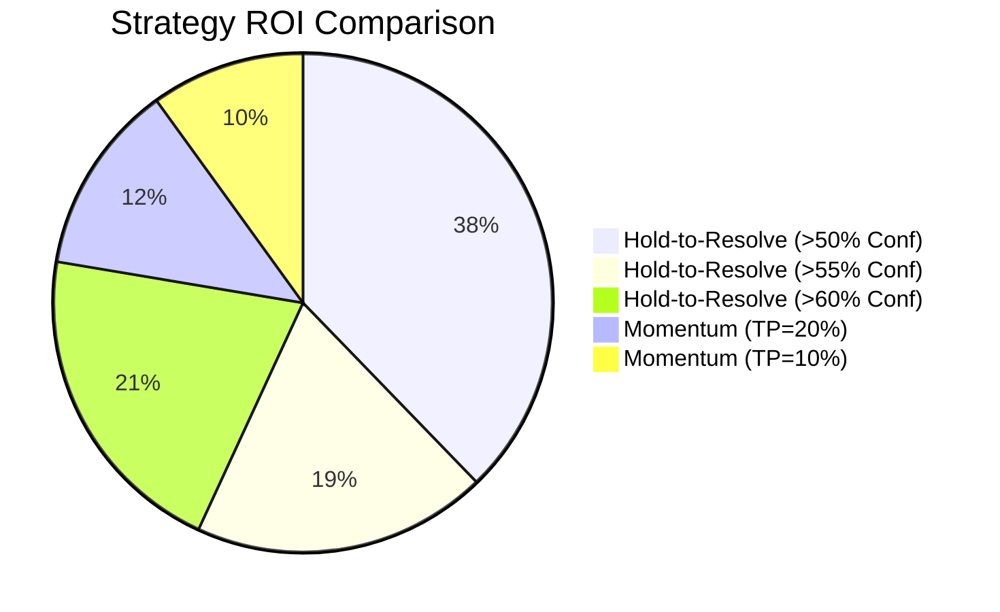

# Polymarket BTC 15min ML Test Bench

## Project Summary

This repository is a machine learning system for predicting BTC price direction (Up/Down) on Polymarket's 15-minute binary options markets. It uses an ensemble of **XGBoost, LightGBM, and Logistic Regression** models trained on high-frequency **Binance trade data** and **Polymarket order book data** to generate alpha.

### 🧠 System Architecture

```mermaid
graph TD
    subgraph Data Sources
        B[Binance WS<br/>(Trade Data)] -->|Real-time Ticks| FE[Feature Engine]
        P[Polymarket WS<br/>(Order Book)] -->|Real-time Ticks| FE
    end

    subgraph "Feature Engineering (Streaming)"
        FE -->|Aggregate| B1[1s Bars]
        FE -->|Context| B5[5s Bars]
        B1 & B5 -->|Compute| FV[53-Feature Vector]
    end

    subgraph "ML Ensemble Inference"
        FV --> M1[XGBoost]
        FV --> M2[LightGBM]
        M1 & M2 -->|Probs| Meta[Logistic Meta-Learner]
        Meta -->|Final Prob| Signal[Signal Aggregator]
    end

    subgraph "Execution"
        Signal -->|Conf > 60%| Strat{Strategy Check}
        Strat -->|Hold-to-Resolve| Ex1[Place Limit Order]
        Strat -->|Momentum| Ex2[Place Limit Order +<br/>Take Profit Logic]
        Ex1 & Ex2 --> CLOB[Polymarket CLOB]
    end
```

## 🏆 Results

### 1-Second Timeframe (Best Model)

| Metric | Value |
|--------|-------|
| **Overall Accuracy** | **65.09%** |
| **>60% Confidence** | **70.63%** (66% coverage) |
| **>65% Confidence** | **74.69%** (48% coverage) |
| **>70% Confidence** | **78.05%** (28% coverage) |
| **Backtest ROI** | **+64.0%** (Hold-to-Resolve Strategy) |

### 📈 Backtest Performance



## 🔬 Key Findings

### Top Predictive Features (SHAP Analysis)
1. **`psp_u` (Polymarket UP Spread)** — #1 Signal. The crowd's uncertainty appearing in the order book spread is the strongest predictor.
2. **`vwap_d` (VWAP Deviation)** — Mean reversion signal from Binance price.
3. **`co` (Close-Open)** — Short-term price momentum within the 1s bar.
4. **`hour_sin` (Time of Day)** — Cyclic temporal patterns matter.

### ⚡ Data Pipeline

```mermaid
sequenceDiagram
    participant B as Binance
    participant P as Polymarket
    participant E as FeatureEngine
    participant M as Model
    
    rect rgb(20, 20, 20)
        Note right of B: Every Millisecond
        B->>E: Trade (Price, Qty, Maker)
        P->>E: OrderBook (Bid, Ask, Size)
    end
    
    rect rgb(40, 40, 60)
        Note right of E: Every 1 Second
        E->>E: Aggregate Ticks -> OHLCV
        E->>E: Compute Technicals (RSI, OFI, VoL)
        E->>E: Stack 5s Context
        E->>M: Send 53-Feature Vector
    end
    
    rect rgb(60, 20, 20)
        M->>M: XGBoost Inference
        M->>M: LightGBM Inference
        M->>M: Meta-Learner Stacking
        M->>E: Return Probability (e.g. 0.72 UP)
    end
```



## 🏗️ Repository Structure

- **`live_trader.py`**: The production trading engine. Connects to WebSockets and trades via API.
- **`ml_bridge.py`**: Lightweight bridge to pipe data from Rust -> Python ML -> Rust.
- **`backtest.py`**: Comprehensive backtesting engine with HTML dashboard output.
- **`ensemble_shap.py`**: Advanced training script using SHAP feature selection and Stacking.
- **`models/`**: Contains the pre-trained `xgb_model.pkl`, `lgb_model.pkl`, and `meta_clf.pkl`.

## 🚀 How to Run

### 1. Installation
```bash
pip install -r requirements.txt
```

### 2. Live Trading (Paper Mode)
```bash
python live_trader.py --min-conf 0.60
```

### 3. VPS Integration (Rust Bridge)
```bash
# Pipes JSON data from your Rust app into the Python ML bridge
./rust_ingest | python ml_bridge.py | ./rust_executor
```

### 4. Retraining
```bash
python fetch_db.py      # Get latest data
python save_models.py   # Train & save new models
```
